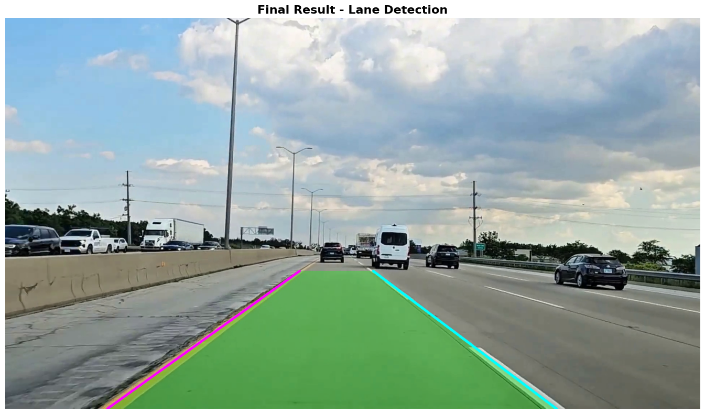
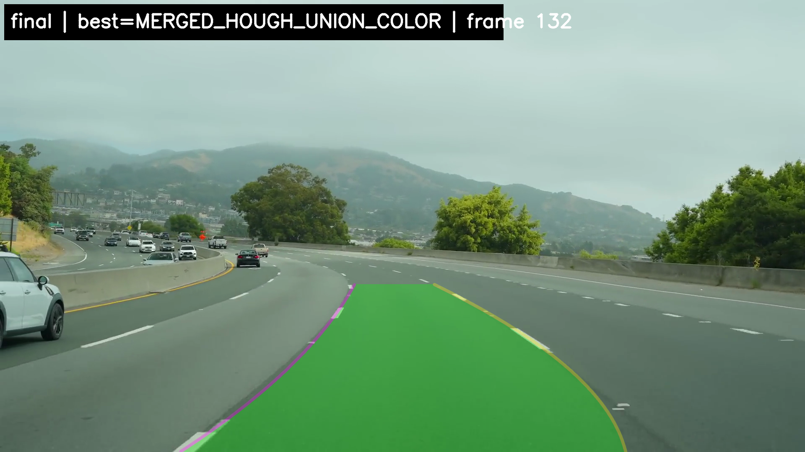
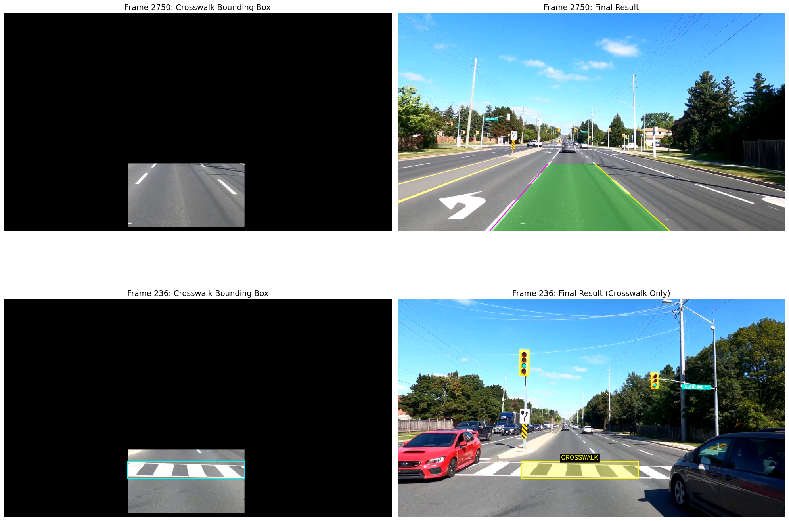
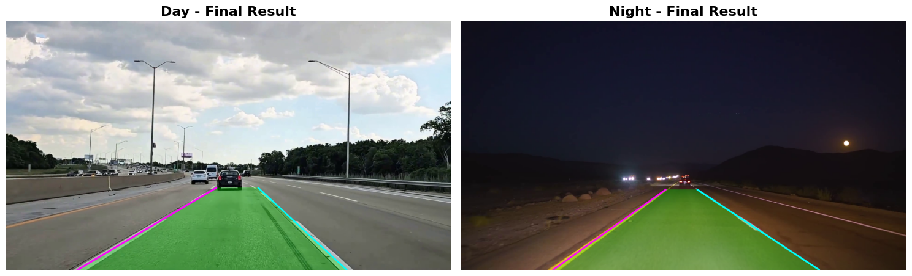

# Lane Detection System

A comprehensive computer vision system for detecting lane lines, curves, crosswalks, and lane changes in driving videos. This project implements multiple detection pipelines optimized for different scenarios including daytime, nighttime, and curved roads.

## Project Overview

This system processes driving videos and detects:
- **Lane boundaries** (left and right lane lines)
- **Curved roads** using polynomial fitting
- **Pedestrian crosswalks** with pattern recognition
- **Lane changes** using temporal tracking
- **Night-time scenarios** with enhanced contrast processing

The system uses classical computer vision techniques including Hough Transform, color thresholding, edge detection, and temporal smoothing to provide robust lane detection across various driving conditions.

## Features

### Core Capabilities
- **Lane Line Detection**: Detects left and right lane boundaries using Hough Transform
- **Curve Detection**: Handles curved roads using polynomial fitting (linear and quadratic)
- **Crosswalk Detection**: Identifies pedestrian crosswalks and temporarily disables lane drawing
- **Night Vision**: Enhanced pipeline optimized for low-light conditions
- **Lane Change Detection**: Detects lane changes using temporal tracking and center-shift analysis
- **Temporal Smoothing**: Stabilizes lane detection across frames using history and EMA

### Technical Highlights
- Multiple ROI (Region of Interest) strategies for different scenarios
- HSV/HLS color thresholding for lane marking detection
- CLAHE (Contrast Limited Adaptive Histogram Equalization) for night vision
- Bilateral filtering for noise reduction
- Polynomial fitting with automatic degree selection
- Geometry enforcement for lane width constraints
- Temporal smoothing using frame history and exponential moving averages

## Project Structure

```
lane-detection/
├── src/
│   ├── pipeline.py                    # Core preprocessing pipeline
│   ├── line_detection.py              # Line detection and video processing
│   └── enhancements/
│       ├── crosswalk_detection.py     # Crosswalk detection system
│       ├── curve_detection.py         # Curve detection video runner
│       ├── curve_detection_pipeline.py # Curve detection helper library
│       └── night_lane_detection.py    # Night-time lane detection
├── output/                            # Output videos directory
├── results/                           # Result images and screenshots
│   ├── core_final_result.png         # Basic lane detection results
│   ├── crosswalk_final_result.png    # Crosswalk detection results
│   ├── curve_final_result.png        # Curve detection results
│   └── night_final_result.png        # Night-time detection results
├── LICENSE                            # License file
└── README.md                          # This file
```

## System Architecture

### Core Pipeline (`pipeline.py`)
The foundation of the system, providing:
- **ROI Masking**: Trapezoidal region of interest masking
- **Color Thresholding**: HSV-based white and yellow lane detection
- **Edge Detection**: Canny edge detection with Gaussian blur
- **Hough Transform**: Probabilistic Hough line detection

### Line Detection (`line_detection.py`)
Post-processing and video handling:
- **Line Filtering**: Filter lines by slope (left/right separation)
- **Lane Fitting**: Merge line segments into single lane lines using linear regression
- **Temporal Smoothing**: `LaneChangeDetector` class for frame-to-frame stability
- **Lane Change Detection**: Detects lane changes based on missing lane periods
- **Video Processing**: Complete video processing pipeline with visualization

### Crosswalk Detection (`crosswalk_detection.py`)
Specialized system for detecting pedestrian crosswalks:
- **Dual ROI System**: Separate ROIs for lane detection and crosswalk detection
- **Horizontal Line Filtering**: Detects crosswalk patterns using horizontal line analysis
- **Lane Smoothing**: `LaneSmoother` class with outlier detection
- **Crosswalk Highlighting**: Visual overlay when crosswalk is detected
- **Smart Lane Disabling**: Temporarily disables lane drawing when crosswalk is detected

### Curve Detection (`curve_detection.py` + `curve_detection_pipeline.py`)
Advanced system for handling curved roads:
- **Asymmetric ROIs**: Left/right ROI regions for better curve handling
- **Polynomial Fitting**: Automatic selection between linear and quadratic fits
- **Temporal Smoothing**: History-based median + EMA smoothing
- **Lane Change Detection**: Multi-height center-shift analysis
- **Geometry Enforcement**: Optional lane width constraints
- **Mask Scoring**: Automatic mask selection based on quality metrics

### Night-Time Detection (`night_lane_detection.py`)
Optimized pipeline for low-light conditions:
- **CLAHE Enhancement**: Contrast improvement for low-light conditions
- **Bilateral Filtering**: Noise reduction while preserving edges
- **Adaptive Thresholding**: Threshold-based lane extraction
- **Robust Detection**: Works on both day and night videos

## Detection Pipelines

### Standard Pipeline (Daytime)
1. **ROI Masking** → Trapezoidal region selection
2. **Color Thresholding** → HSV white/yellow detection
3. **Morphological Operations** → Noise removal and gap filling
4. **Canny Edge Detection** → Edge extraction
5. **Hough Transform** → Line detection
6. **Slope Filtering** → Left/right lane separation
7. **Lane Fitting** → Linear regression
8. **Temporal Smoothing** → Frame history averaging
9. **Visualization** → Lane overlay and polygon

### Curve Detection Pipeline
1. **Asymmetric ROI** → Left/right ROI regions
2. **Color Masking** → HSV + HLS with CLAHE
3. **Mask Merging** → Gradient + color mask combination
4. **Hough Detection** → Initial line detection
5. **Pixel Selection** → Hough-proximity pixel selection
6. **Polynomial Fitting** → Linear/quadratic selection
7. **Temporal Smoothing** → History median + EMA
8. **Geometry Enforcement** → Optional width constraints
9. **Curve Visualization** → Polynomial curve overlay

### Night-Time Pipeline
1. **ROI Masking** → Trapezoidal region
2. **Grayscale Conversion** → Single channel processing
3. **CLAHE Enhancement** → Contrast improvement
4. **Bilateral Filtering** → Noise reduction
5. **Thresholding** → Binary lane extraction
6. **Canny Edge Detection** → Edge detection
7. **Hough Transform** → Line detection
8. **Temporal Smoothing** → Frame history
9. **Visualization** → Lane overlay

## Key Algorithms

### Temporal Smoothing
- **History Buffer**: Maintains a deque of recent frame detections
- **Averaging**: Smooths lane positions by averaging over history
- **Outlier Detection**: Identifies and filters anomalous detections
- **EMA Smoothing**: Exponential moving average for gradual changes

### Lane Change Detection
- **Missing Frame Analysis**: Detects when both lanes disappear
- **Center Shift Analysis**: Tracks vehicle position relative to lane center
- **Multi-Height Evaluation**: Checks consistency across multiple y-positions
- **Debouncing**: Requires persistent conditions before triggering

### Crosswalk Detection
- **Horizontal Line Analysis**: Identifies long horizontal lines
- **Pattern Recognition**: Looks for two parallel horizontal lines
- **Bounding Box Validation**: Ensures minimum size requirements
- **Temporal Integration**: Smooths detection across frames

### Curve Detection
- **Polynomial Fitting**: Fits x(y) polynomials of degree 1 or 2
- **Error Analysis**: Compares linear vs quadratic fit quality
- **Automatic Selection**: Chooses best fit based on error metrics
- **Geometry Constraints**: Enforces realistic lane widths

## Output Features

The system generates annotated videos with:
- **Lane Overlay**: Green polygon showing detected lane area
- **Lane Lines**: Colored lines (magenta for left, cyan for right)
- **Status Information**: Frame count, detection status
- **Lane Change Warnings**: Red alert when lane change detected
- **Crosswalk Highlighting**: Yellow overlay for detected crosswalks
- **Curvature Information**: Radius and direction for curves

## Results

### Lane Detection Results



*Basic lane detection showing left and right lane boundaries with green overlay and lane change detection.*

### Curve Detection Results



*Curve detection using polynomial fitting to handle curved roads with curvature radius calculation.*

### Crosswalk Detection Results



*Crosswalk detection system identifying pedestrian crosswalks and temporarily disabling lane drawing.*

### Night-Time Detection Results



*Night-time lane detection optimized for low-light conditions using CLAHE enhancement and bilateral filtering.*

## Technical Details

### Parameters

**ROI Parameters:**
- `top_y_ratio`: Vertical position of trapezoid top (0-1)
- `left_bottom_ratio`: Left edge at bottom (0-1)
- `right_bottom_ratio`: Right edge at bottom (0-1)
- `top_left_x_ratio`: Left edge at top (0-1)
- `top_right_x_ratio`: Right edge at top (0-1)

**Color Thresholding:**
- HSV bounds for white and yellow lanes
- Morphological operations (opening, closing, dilation)

**Edge Detection:**
- Canny edge detection with configurable thresholds
- Gaussian blur preprocessing

**Hough Transform:**
- Probabilistic Hough Transform
- Configurable resolution, thresholds, and line length

**Temporal Smoothing:**
- History buffer size
- Minimum valid frames for smoothing
- Missing frame thresholds for lane change detection

## Requirements

- Python 3.7+
- OpenCV (cv2)
- NumPy
- Standard library modules (collections, os, sys, argparse)

## Installation

```bash
pip install opencv-python numpy
```

## Usage Example

The system processes videos through various detection pipelines. Each module can be used independently or combined:

```python
# Basic lane detection
from src.line_detection import process_video
process_video(video_path, output_path)

# Curve detection
from src.enhancements.curve_detection import process_video_with_curve_prediction
process_video_with_curve_prediction(video_path=video_path, output_path=output_path)

# Crosswalk detection
from src.enhancements.crosswalk_detection import process_video_crosswalk
process_video_crosswalk(video_path, output_path)

# Night-time detection
from src.enhancements.night_lane_detection import process_video_night_robust
process_video_night_robust(video_path, output_path)
```

## Performance Characteristics

- **Frame Processing**: Processes every 2nd frame by default to reduce file size
- **Resolution**: Output videos resized to 1280x720 if input is larger
- **Memory**: Uses deque for efficient history management
- **Processing Speed**: Optimized for batch processing

## Project Highlights

This project demonstrates:
- **Classical Computer Vision**: Traditional CV techniques without deep learning
- **Multiple Detection Strategies**: Different approaches for different scenarios
- **Temporal Consistency**: Frame-to-frame smoothing and tracking
- **Robustness**: Handles various lighting and road conditions
- **Modular Design**: Separate modules for different detection tasks

## Future Enhancements

Potential improvements:
- Deep learning-based lane detection
- Multi-lane detection (3+ lanes)
- Real-time processing optimization
- Additional road sign detection
- Integration with vehicle control systems

## License

See LICENSE file for details.
